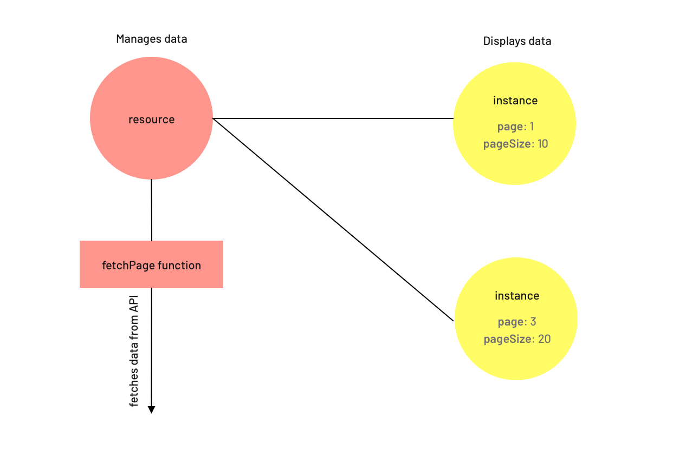

# vuex-pagination

[](https://standardjs.com)
[](http://travis-ci.org/cyon/vuex-pagination)

Note: This library only works with Vue 2. For Vue 3, take a look at [vue-use-pagination](https://www.github.com/cyon/vue-use-pagination).

Library that makes it magnitudes easier to integrate paginated resources from an API
(REST, GraphQL, or anything else) into your Vue application.

## How does it work?

Resources in `vuex-pagination` directly map to their corresponding resources in the API. The
resource itself "lives" in the Vuex store and manages the already fetched data.

To initialize a new resource you have to provide a `fetchPage` function. This function
receives some parameters like the current page and the page size and fetches the data from the
API.

To display data in your Vue components, you can initialize instances. There can be multiple
instances for every resource and all of them can have a different state (current page, page size
etc).



Because of this approach, `vuex-pagination` is suited regardless of the used API. It can also
work with data read directly from the file system, for example in Electron applications.

## Installation

```bash
// Using npm:
npm install vuex-pagination

// Or using Yarn:
yarn add vuex-pagination
```

If you don't have already, make sure to also install the `vuex` package.

## Usage

To use it in your application you'll need to install the package as
a Vue plugin. This can be done as follows:

```javascript
import Vue from 'vue'
import Vuex from 'vuex'
import { PaginationPlugin } from 'vuex-pagination'

Vue.use(Vuex)
Vue.use(PaginationPlugin)
```

**Warning:** Vuex is needed for the plugin to work. It needs to be initialized
even if you don't use it directly yourself.

<br>

### `createResource(name, fetchPage, opts)`

| Parameter           | Type     | Required / Default Value | Description                         |
|---------------------|----------|--------------------------|-------------------------------------|
| name                | string   | required                 | Name of the resource                |
| fetchPage           | function | required                 | Function to fetch a single page     |
| opts                | object   | null                     | Optional arguments                  |
| opts.prefetch       | boolean  | false                    | Automatically prefetch items        |
| opts.cacheResources | number   | 20                       | How many resources should be cached |

The `fetchPage` function receives a single `opts` parameter that looks like the following:

| Parameter     | Type   | Description                                             |
|---------------|--------|---------------------------------------------------------|
| opts.page     | number | Page to fetch                                           |
| opts.pageSize | number | Selected page size                                      |
| opts.args     | object | Optional arguments that can be passed from the instance |

The `fetchPage` function has to return a Promise which fulfills after the
page was fetched and should return an object:

```javascript
{
  total: 33, // how many items are there in total?
  data: items // array of the items
}
```

<details>
  <summary>Show example</summary>

  The `createResource` is usually done in your store logic. If you didn't use Vuex directly
  it can also be where you're initializing your Vue application.

  Here is an example of how a resource could be initialized:

  ```javascript
import { createResource } from 'vuex-pagination'

async function fetchUsers (opts) {
  let users = window.fetch(`/users?page=${opts.page}&limit=${opts.pageSize}`)
    .then((response) => response.json())
    .catch((error) => {
        this.dispatch('SHOW_GLOBAL_ERROR_MESSAGE', error.response.data.message);
        return {
            total: 0,
            data: [],
        };
    });

  return {
    total: users.total,
    data: users.items
  }
}

createResource('users', fetchUsers, {
  prefetch: true
})
  ```
</details>

<br>

### `createInstance(name, opts)`

| Parameter     | Type     | Required / Default Value | Description                                             |
|---------------|----------|--------------------------|---------------------------------------------------------|
| name          | string   | required                 | Name of the resource                                    |
| opts          | object   | required                 | Options                                                 |
| opts.page     | number   | 1                        | Initial page                                            |
| opts.pageFrom | number   | null                     | Range mode: start page                                  |
| opts.pageTo   | number   | null                     | Range mode: last page                                   |
| opts.pageSize | number   | 20                       | Initial page size                                       |
| opts.args     | function | undefined                | Function that returns an object of additional arguments |

For every resource there can be one or many instances. That means that this data can be
shown on different parts of your application and we'll still just download everything
once.

An instance can be created like this:

```javascript
import { createInstance } from 'vuex-pagination'

// this is our Vue component
export default {
  computed: {
    licenses: createInstance('users', {
      page: 1,
      pageSize: 10
    })
  }
}
```

The instance has the following properties:

| Property   | Type    | Description                                        | Reactive |
|------------|---------|----------------------------------------------------|----------|
| page       | number  | Current page                                       | true     |
| pageSize   | number  | Selected page size                                 | true     |
| items      | array   | Items for the current page                         | false    |
| total      | number  | Total amount of items                              | false    |
| totalPages | number  | Total number of pages (based on current page size) | false    |
| loading    | boolean | Whether data is being fetched currently            | false    |

The `items` property is your data which can be displayed then.

<details>
  <summary>See example</summary>

  ```vue
<template>
  <li v-for="user in users.items" :key="user.id" class="user">
    <span class="name">{{user.name}}</span>
  </li>
</template>
  ```
</details>

The `page` and `pageSize` attributes are reactive, it means you can use them as
[`v-model`](https://vuejs.org/v2/api/#v-model) in your component - or just set them
programmatically.

<details>
  <summary>See example</summary>

  ```vue
<select v-model="users.pageSize">
  <option :value="5">5</option>
  <option :value="10">10</option>
  <option :value="20">20</option>
</select>
  ```
</details>

<br>

#### Standard vs range mode

In the standard mode you always get a single page while in the range mode you'll see
a list of pages at once. This can be especially useful when you're implementing an endless
scrolling feature.

But be aware that the results are still paged in the background using the `pageSize` you specified.
So if you create a new instance, set `pageFrom` and `pageTo` both to `1`, then set the `pageTo` to
`3`, the `fetchPage` function will be called twice. Once for the second and once for the third page.

<details>
  <summary>See example</summary>

  ```vue
<template>
  <div>
    <ul>
      <li v-for="user in users.items" :key="user.id">{{ user.name }}</li>
    </ul>
    <a @click.prevent="users.pageTo += 1">Show more...</a>
  </div>
</template>
<script>
import { createInstance } from 'vuex-pagination'

export default {
  computed: {
    users: createInstance('users', {
      pageFrom: 1,
      pageTo: 1,
      pageSize: 30
    })
  }
}
</script>
  ```
</details>

<br>

#### Passing arguments

Often you'll have to pass different kinds of arguments or parameters to a
resource. Think filters, query parameters or different headers, just to name a few.

This can be done with the `args` function inside the `createInstance`
call:

```javascript
import { createInstance } from 'vuex-pagination'

export default {
  data () {
    return {
      query: ''
    }
  },
  computed: {
    licenses: createInstance('users', {
      page: 1,
      pageSize: 10,
      args () {
        return {
          query: this.query
        }
      }
    })
  }
}
```

Every time the return value of the `args` function changes, the results
are being fetched again. If your arguments are not ready yet (maybe they get passed
as a prop), the function should just return `null` and then the `fetchPage`
function will not be called yet.

<br>

### Pre-fetching and caching

Internally, fetched items are being saved in specific registries - one for every combination
of arguments. Registries themselves have no concept of different pages, they are just one
big list. Only the instances with their own parameters (`page` and `pageSize`) break
those down into smaller chunks.

This means that data, that was fetched once, does not have to be downloaded again - it's
already in the registry. Using `prefetch` you can also ensure that the data for the next
page is already present:

```javascript
import { createResource } from 'vuex-pagination'

const controller = createResource('users', fetchLicensesPage, { prefetch: true })
```

If you have an instance where your user navigates to the second page, we'll already
calculate the third page and download all the items so the transition in the pagination
is seamless.

Due to the fact that we create a new registry for every combination of arguments, there
can also be a large amount of unused registries which then use up memory. Those are
good to keep around, as it can happen that we'll use the same combination again and
then we already have the results around but often, those are not needed anymore and
we garbage collect those automatically. The amount of unused registries is 20 per default
but you can set this value yourself like this:

```javascript
import { createResource } from 'vuex-pagination'

const controller = createResource('users', fetchUsersPage, { cacheResources: 30 })
```

<br>

### Usage in Vuex store

The return value of `createResource` is a controller that allows you to trigger certain
actions on the resource itself from store actions. You can also retrieve a controller
to a defined resource using the `resource` function:

```javascript
import { resource, createResource } from 'vuex-pagination'

const resource = createResource('users', fetchUsersPage)
// ...or:
const resource = resource('users')
```

To re-fetch a specific resource (for example to poll changes) you can use the controller's
`refresh` function.

If you want to work with paginated items inside your store you might want to use
the `fetchRange` function:

```javascript
import { resource } from 'vuex-pagination'

resource('users').fetchRange({
  pageFrom: 1,
  pageTo: 5,
  pageSize: 10
}).then((items) => {
  console.log(items)
})
```

**Please note:** In previous versions the `resource` function was called `controller`. This
is deprecated but will continue to work in `1.x` versions of this package.

## Examples

We prepared a few examples for different use-cases. These can be found in the `examples/` folder.

If you cloned this repository, you can run the examples by navigating to the respective folder
and running `npm run serve`.

## Tests

Tests are implemented using [Jest](https://jestjs.io/) and
[vue-test-utils](https://vue-test-utils.vuejs.org/). They can be run like this: `npm test`

Coding style is [Standard](https://standardjs.com/) and is tested in the `test` script too.
